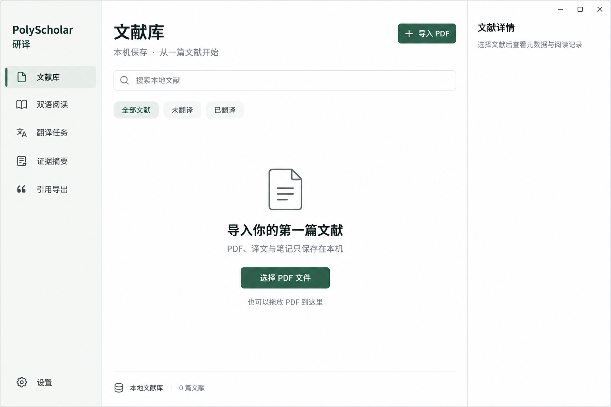
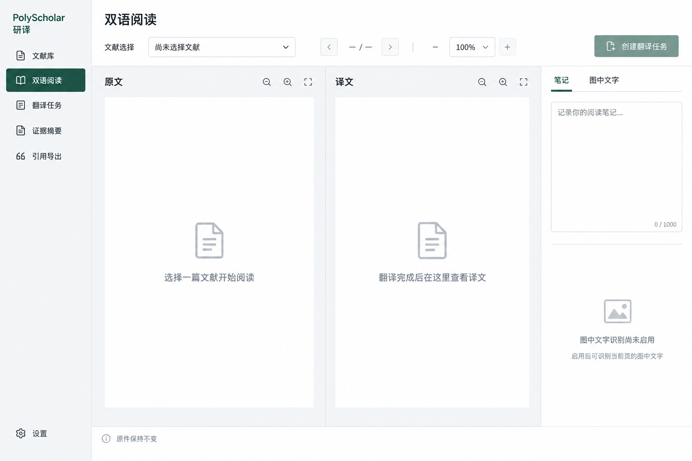
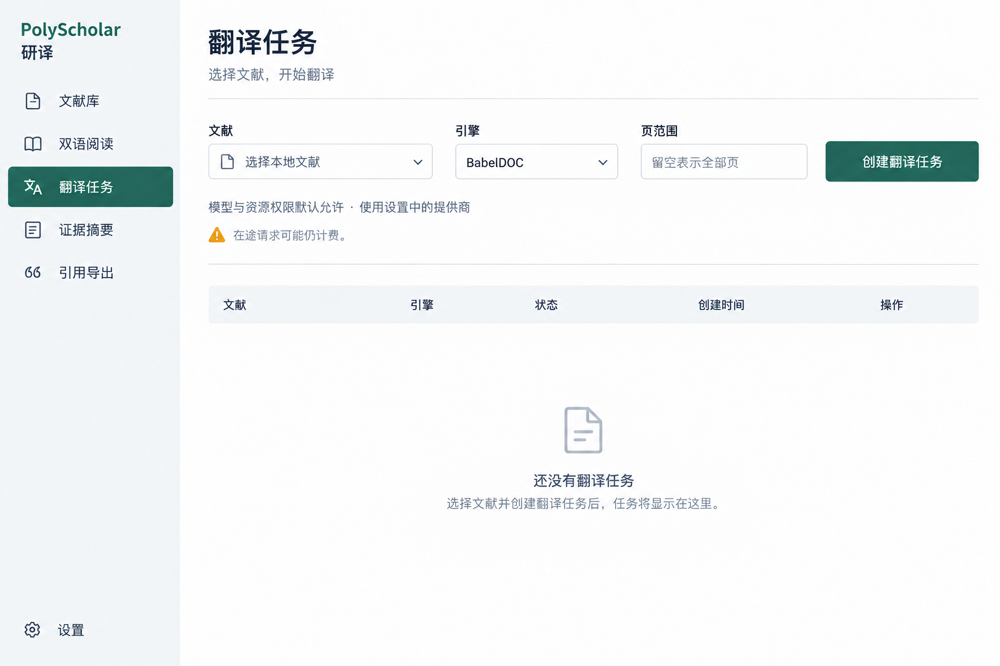
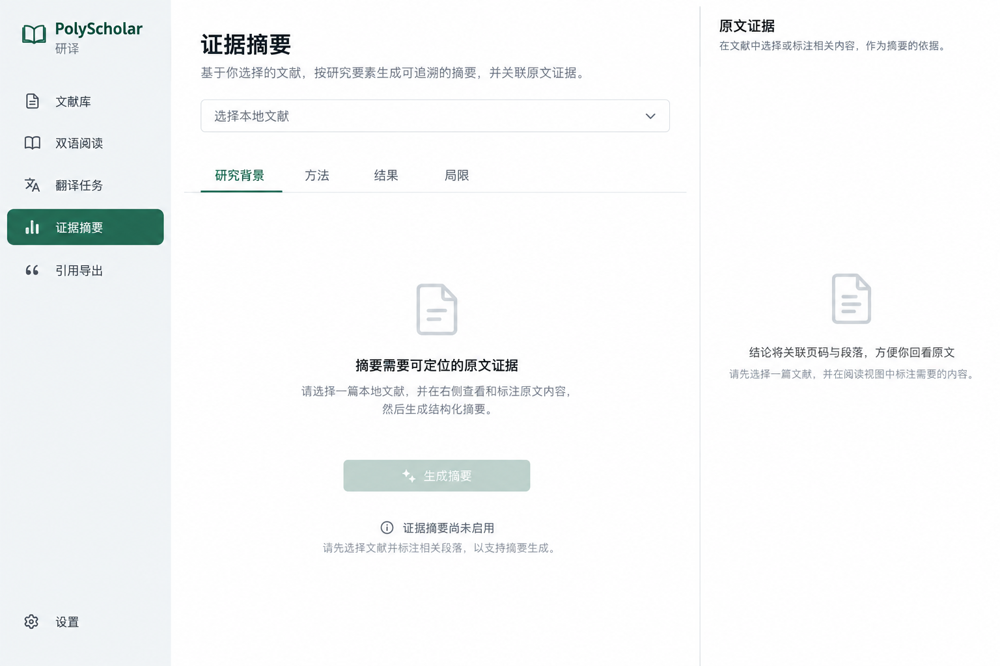
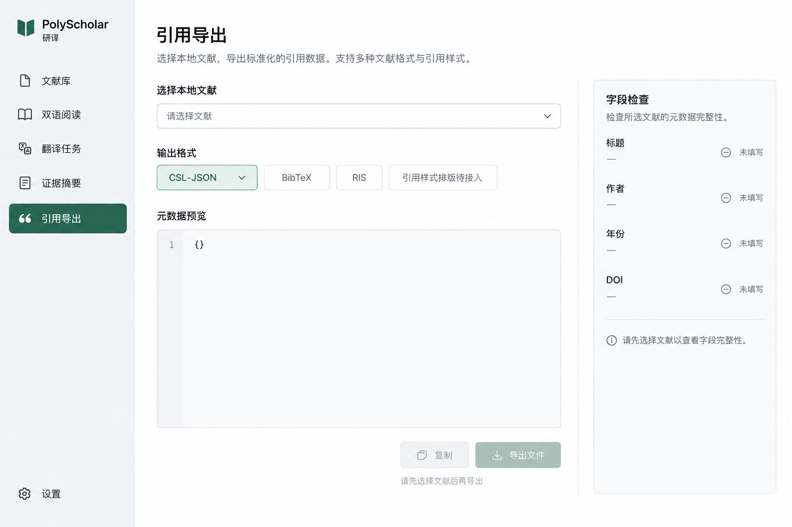
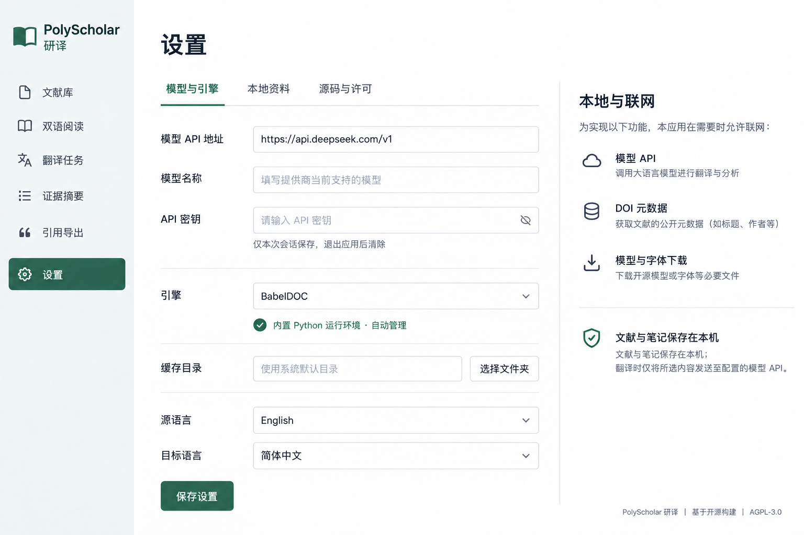
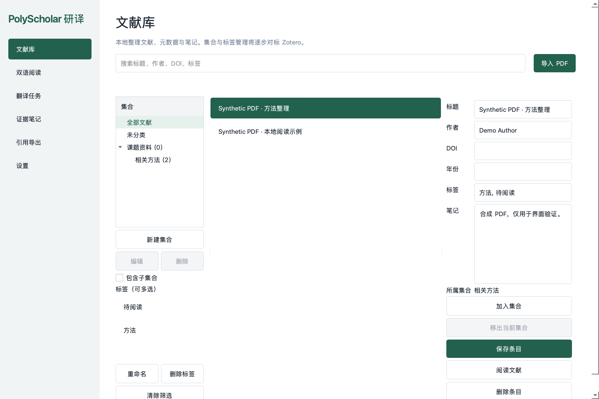
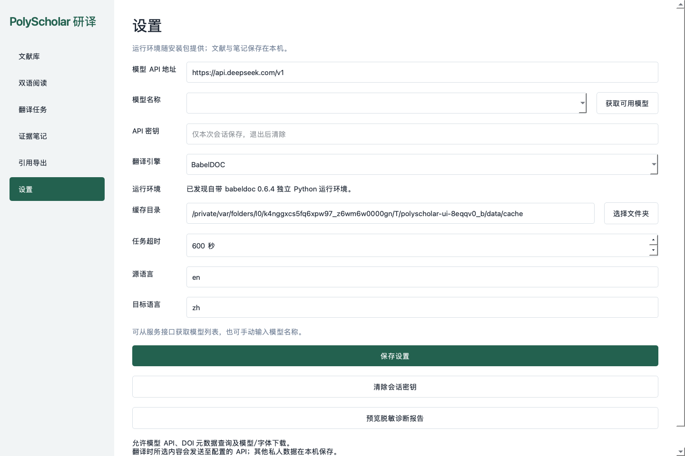
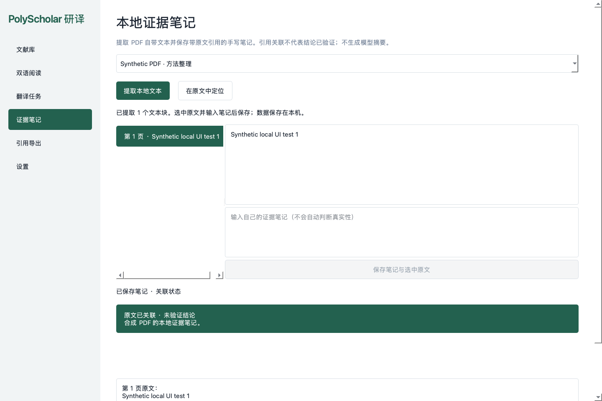

<div align="center">

# PolyScholar · 研译

**你的本地双语文献工作台**

文献管理 · 论文翻译 · 双语阅读 · 笔记与引用

[](https://github.com/Kelvin-LH/PolyScholar/actions/workflows/core.yml)
[](pyproject.toml)
[](LICENSE)
[](https://github.com/Kelvin-LH/PolyScholar/stargazers)

[界面预览](#界面预览) · [快速开始](#快速开始) · [开发路线](#开发路线) · [文档](#文档) · [参与贡献](#参与贡献)

</div>

> 开发中，尚未发布安装包。



## 核心功能

- **本地文献库**：集合与子集合、PDF 导入、文件去重、标签筛选与笔记，文献管理对标 Zotero。
- **双引擎翻译**：集成 [BabelDOC](https://github.com/funstory-ai/BabelDOC) 与 [PDFMathTranslate](https://github.com/PDFMathTranslate/PDFMathTranslate)，原文与译文分开保存。
- **双语阅读**：原文与译文并排显示，在桌面内完成阅读。
- **证据笔记**：本地提取文本、引用原文并跳转页码，重新解析后提示旧引用失效。
- **自选模型**：支持 DeepSeek 等兼容 API，自动获取可用模型，也可手动填写。
- **文件导出**：导出译文 PDF，以及 BibTeX、RIS、CSL-JSON 文献元数据。
- **个人桌面**：Python + PySide6 + SQLite，无需服务器或账户。发行包自带 Python，缓存目录可调整。

文献与笔记保存在本机。联网用于模型 API、DOI 元数据查询及模型/字体下载；翻译时会向模型 API 发送论文内容。[数据边界 →](docs/09-local-and-network-scope.md)

## 界面预览

### 双语阅读 · 设计效果图



### 翻译任务 · 设计效果图



<details>
<summary>更多界面设计</summary>

**证据摘要**



**引用导出**



**模型与本地设置**



</details>

<details>
<summary>查看当前原生界面截图</summary>

Python / PySide6 原型，使用合成测试 PDF。







</details>

## 快速开始

当前可从源码运行，需 Python 3.12+。

```sh
git clone https://github.com/Kelvin-LH/PolyScholar.git
cd PolyScholar
python -m pip install -e .
python -m polyscholar
```

翻译引擎准备与自带 Python 打包见 [运行环境指南](integrations/EMBEDDED_RUNTIME.md)。

1. 导入本地 PDF。
2. 在设置中填写 API 地址与密钥，获取并选择模型。
3. 选择引擎与页范围，创建翻译任务。
4. 阅读或导出翻译结果。

## 开发路线

- [x] Python 原生桌面与本地 SQLite 文献库
- [x] PDF 导入、去重、元数据与笔记
- [x] 模型配置与模型列表获取
- [x] 双引擎任务适配、译文导出与缓存目录
- [x] 集合与子集合、多集合归类、标签联合筛选
- [ ] 多附件、高级检索与回收站
- [ ] 带原文定位的证据摘要
- [ ] 图中文字注释与段落对齐
- [ ] CSL 引文样式排版
- [ ] Windows / macOS / Linux 正式安装包

macOS arm64 开发包已通过启动检查。真实 API 翻译与三平台安装待验收。[验证记录 →](docs/07-validation.md)

## 文档

[产品需求](docs/02-requirements.md) · [架构设计](docs/03-architecture.md) · [翻译与 AI](docs/04-document-and-llm.md) · [界面规范](docs/10-ui-spec.md) · [研发计划](docs/11-development-plan.md) · [Zotero 对标](docs/12-zotero-parity.md) · [自查整改](docs/14-review-remediation.md)

## 参与贡献

欢迎提交 [Issue](https://github.com/Kelvin-LH/PolyScholar/issues) 或 Pull Request。提交前请阅读 [贡献指南](CONTRIBUTING.md)。

```sh
python scripts/check_baseline.py
python -m unittest discover -s tests -v
```

安全问题请参阅 [SECURITY.md](SECURITY.md)。

## 致谢与许可

感谢 [BabelDOC](https://github.com/funstory-ai/BabelDOC)、[PDFMathTranslate](https://github.com/PDFMathTranslate/PDFMathTranslate) 与 [Qt for Python](https://doc.qt.io/qtforpython-6/) 提供基础能力。

[AGPL-3.0-only](LICENSE) · 允许商业使用，遵守适用的源码公开与通知义务。

[第三方许可](THIRD_PARTY_NOTICES.md) · [来源追踪](docs/05-licensing-and-traceability.md)

## Star History

[](https://www.star-history.com/#Kelvin-LH/PolyScholar&Date)
