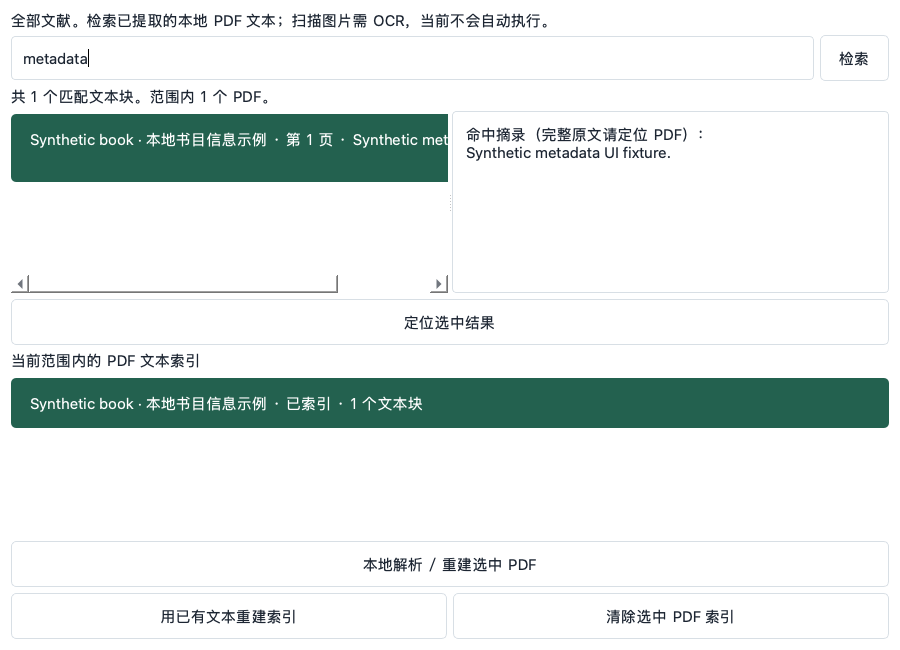

<div align="center">

# PolyScholar · 研译

**你的本地双语文献工作台**

文献管理 · 论文翻译 · 双语阅读 · AI 评分与提炼 · agent 可编程

[](https://github.com/Kelvin-LH/PolyScholar/actions/workflows/core.yml)
[](pyproject.toml)
[](LICENSE)
[](https://github.com/Kelvin-LH/PolyScholar/stargazers)

[界面预览](#界面预览) · [快速开始](#快速开始) · [开发路线](#开发路线) · [文档](#文档) · [参与贡献](#参与贡献)

</div>

> 开发中，尚未发布安装包。


## 这是什么

一个**本地优先**的个人学术文献工具：文献管理对标 Zotero，arXiv 论文一键翻译成双语 HTML，再用可核验的 AI 工作流给论文打分和提炼。所有数据存在本机 SQLite，无账户、无云同步；联网仅发生在你明确触发的动作（arXiv 拉取、模型 API）。[数据边界 →](docs/09-local-and-network-scope.md)

## 核心功能

- **本地文献库**：集合与子集合、多 PDF 附件、五类文献信息、有序个人/机构作者、标签、高级检索、保存搜索与 PDF 全文检索。
- **双语翻译**：arXiv 论文整篇翻译为纯中文双语 HTML，保留图表与公式；译文归属文献，可导出。
- **AI 评分（论文分 + 置信度）**：依据 [rubrics/](rubrics/) 两份量化打分文档，由三个隔离子代理盲评、取中位数、极差超限强制复核；合卷、校验、归档全部程序化（[评分工作流 →](cli.md#评分paper--confidence)）。文献详情页可查看完整评分明细（维度得分/得失分点/三评委原文），支持按分数排序。
- **AI 提炼**：两个子代理按固定契约提取**解决的问题 / 使用的方法 / 实验效果 / 不足与缺陷**，程序合并去重后写入文献，四节清单可溯源到代理与出处。
- **文件导出**：导出译文 HTML，以及 BibTeX、RIS、CSL-JSON 文献元数据。
- **个人桌面**：Python + PySide6 + SQLite，无需服务器或账户。

## 命令行与 MCP（AI agent 入口）

PolyScholar 把整个文献库暴露给 AI agent：GUI、CLI、MCP 三种入口共用同一服务层与校验。

```sh
polyscholar-cli add --arxiv 2503.19755          # 导入(支持批量)
polyscholar-cli parse <doc> && polyscholar-cli text <doc> --json   # 解析并取全文
polyscholar-cli score aggregate --kind paper --reports A.json B.json C.json \
    --apply <doc> --rationale-file r.md          # 三盲评合卷一次入库
polyscholar-cli search "蒸馏" --doc <doc>         # 全文定位,免整篇重读
polyscholar-cli status --json                    # 库状态(锁/计数),不取锁
```

内置 MCP server（[mcp.md](mcp.md)）以 `cli_docs` + `cli_run` 两个工具把 [cli.md](cli.md) 契约直接交给 Claude/Cursor/ZCode 等 AI 客户端；评分与提炼的"智能"在 agent 侧，程序侧强制执行 rubric 规则（结构校验、中位数、复核门槛、材料包一致性）。

## 界面预览

### 双语阅读 · 设计效果图


### 翻译任务 · 设计效果图


<details>
<summary>更多界面设计</summary>

**引用导出**


**模型与本地设置**


</details>

<details>
<summary>查看当前原生界面截图</summary>

Python / PySide6 原型，使用合成测试 PDF。




</details>

## 快速开始

当前可从源码运行，需 Python 3.12+。

```sh
git clone https://github.com/Kelvin-LH/PolyScholar.git
cd PolyScholar
python -m pip install -e .
python -m polyscholar
```

1. 导入本地 PDF 或粘贴 arXiv 链接。
2. 在设置中填写模型 API 地址与密钥。
3. 创建翻译任务，双语阅读或导出。
4. （可选）接入 MCP 后，让你的 AI agent 按 rubrics 完成评分与提炼——见 [mcp.md](mcp.md)。

## 开发路线

近期的方向（UI 简化、评分的联网核验、置信度的开源真实性核验等）整理在 [docs/16-roadmap.md](docs/16-roadmap.md)。已完成能力的验收记录见 [docs/14-review-remediation.md](docs/14-review-remediation.md)。

## 参与贡献

欢迎提交 [Issue](https://github.com/Kelvin-LH/PolyScholar/issues) 或 Pull Request。提交前请阅读 [贡献指南](CONTRIBUTING.md)。

```sh
python scripts/check_baseline.py
python -m unittest discover -s tests -v
```

安全问题请参阅 [SECURITY.md](SECURITY.md)。

## 致谢与许可

[AGPL-3.0-only](LICENSE) · 允许商业使用，遵守适用的源码公开与通知义务。

[第三方许可](THIRD_PARTY_NOTICES.md) · [来源追踪](docs/05-licensing-and-traceability.md)

## Star History

[](https://www.star-history.com/#Kelvin-LH/PolyScholar&Date)
