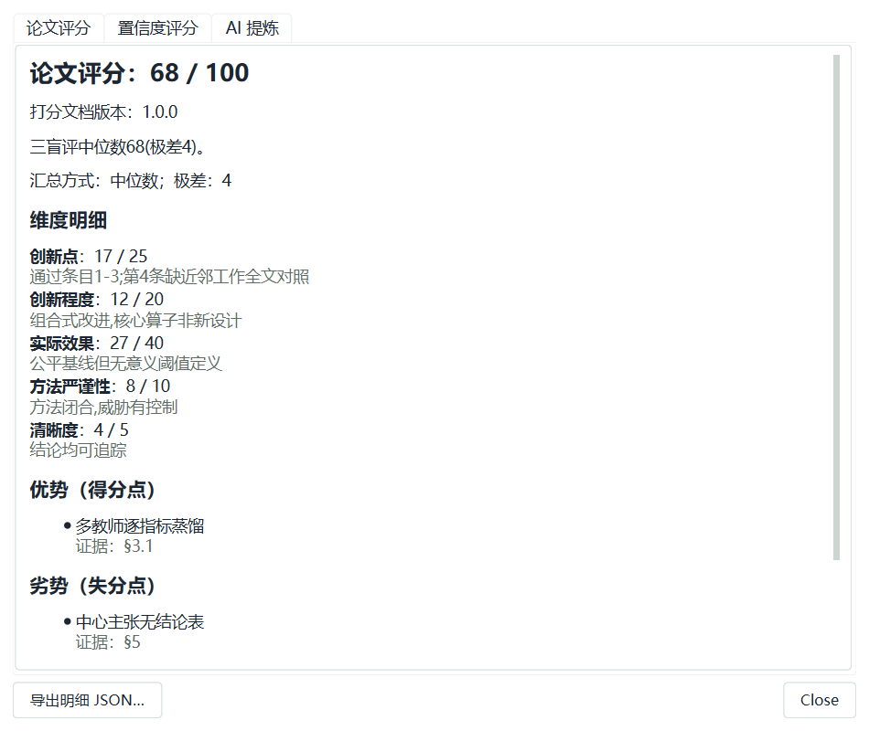
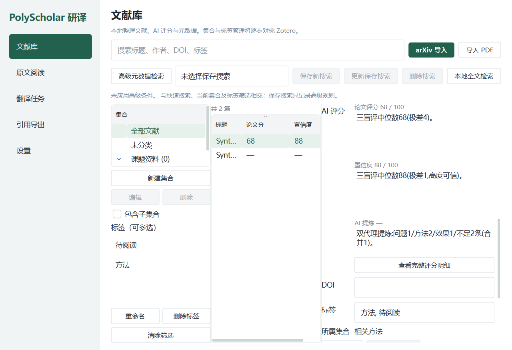

<div align="center">

# PolyScholar · 研译

**本地论文库 × 可核验的 AI 评分工作台**

让 AI agent 按量化量表读论文、盲评打分、结构化提炼——每个分数都能翻回原文核对。

[](https://github.com/Kelvin-LH/PolyScholar/actions/workflows/core.yml)
[](pyproject.toml)
[](LICENSE)

[功能总览](#功能总览) · [AI 评分工作流](#ai-评分工作流) · [MCP 接入配置](#mcp-接入配置) · [开发路线](#开发路线)

</div>

> 开发中，尚未发布安装包。


## 功能总览

| 功能 | 说明 |
|---|---|
| **本地文献库** | 导入本地 PDF / 粘贴 arXiv 链接自动抓取元数据；集合与子集合、多附件、五类文献类型、有序作者、标签、高级检索与保存搜索（对标 Zotero 的个人工作流） |
| **双语翻译** | arXiv 论文整篇翻译为双语 HTML，保留图表与公式，译文归属文献、可导出 |
| **AI 评分（论文分）** | 按 [20 条目量化量表](rubrics/paper-scoring.md)（创新点/创新程度/实际效果/严谨性/清晰度）三代理盲评取中位数，极差超限强制复核；明细到"每个维度得在哪里、卡在哪一条、依据原文哪句" |
| **AI 评分（置信度）** | 按 [四维量表](rubrics/confidence-scoring.md)（证据强度/内部一致性/来源可溯源/结果合理性）+ 红旗清单扣分，输出五档可信结论；**只评估文本内证据，不判断科学真伪** |
| **AI 提炼** | 两个子代理按固定契约提取**解决的问题 / 使用的方法 / 实验效果 / 不足与缺陷**，程序合并去重，每条标注来源代理与出处 |
| **全文检索** | 解析后支持库级/单篇中文全文定位（`search` 命令），复核评分免整篇重读 |
| **元数据导出** | BibTeX / RIS / CSL-JSON，与界面预览同一格式器 |
| **三种入口** | 桌面端（PySide6）、命令行（`polyscholar-cli`）、MCP server——同一服务层、同一校验、同一份数据 |



## AI 评分工作流

打分的"智能"在你的 AI agent 侧，规则强制在程序侧：

```sh
polyscholar-cli rubric show paper            # agent 先取打分文档(含版本与 SHA-256)
polyscholar-cli parse <doc>                  # 解析全文
polyscholar-cli text <doc> --pages 2-5       # 按页阅读;search "关键词" --doc <doc> 全文定位
# agent 开三个隔离子代理,各写一份评分报告 JSON(不允许单会话连演三位评委)
polyscholar-cli score aggregate --kind paper \
    --reports A.json B.json C.json --apply <doc> --rationale-file r.md
```

- 程序侧强制执行：逐份结构校验、冻结材料包一致性、中位数、A→B→C 代表报告规则；
- 极差超限（论文 >10 / 置信度 >15）时**拒绝合卷**，返回分歧条目清单 + 复核指令模板，复核后 `--recheck` 重跑；
- 提炼只需两个子代理（`--kind summary`），四节契约、程序合并去重、`--apply` 直写；
- 全部命令支持 `--json`；成功回执只报结果不回显明细，为 agent 省 token。

完整命令契约见 [cli.md](cli.md)。

## MCP 接入配置

PolyScholar 内置 stdio MCP server，把整条命令契约交给 AI 客户端。agent 只会拿到两个工具：`cli_docs`（读命令手册）和 `cli_run`（执行白名单内的命令）——它因此能完成上面所有工作流，但拿不到你的 API 密钥。

**第一步：安装 MCP 依赖**

```sh
python -m pip install -e ".[mcp]"
```

**第二步：在客户端配置里注册 server**

ZCode（`~/.zcode/cli/config.json`）：

```json
{
  "mcp": {
    "servers": {
      "polyscholar": {
        "command": "polyscholar-mcp",
        "env": {
          "POLYSCHOLAR_DATA_DIR": "D:\\path\\to\\PolyScholar\\data",
          "HTTPS_PROXY": "http://127.0.0.1:7890"
        }
      }
    }
  }
}
```

Claude Desktop（`claude_desktop_config.json`）与 Cursor 同型，外层键换成 `"mcpServers"` 即可。从源码运行时把 `command` 换成你的 Python、`args` 换成 `["-m", "polyscholar.mcp_server"]`，并在 `env` 里加 `"PYTHONPATH": "仓库路径"`。

**环境变量（全部可选）**

| 变量 | 作用 |
|---|---|
| `POLYSCHOLAR_DATA_DIR` | 资料目录；源码运行默认仓库 `data/`，与 GUI 一致 |
| `POLYSCHOLAR_CLI_MD` / `POLYSCHOLAR_RUBRICS_DIR` | 命令契约 / 打分文档的替代位置 |
| `HTTPS_PROXY` / `HTTP_PROXY` | arXiv 拉取走代理（国内网络常用） |

**第三步：重启客户端，对 agent 说"给这篇论文评分"即可。**

注意事项：

- **单实例锁**：GUI 与 MCP 不能同时打开同一资料目录——让 agent 操作前先关闭桌面窗口（锁冲突时命令返回退出码 2，`status` 命令可查锁状态）；
- agent 的每次写入都经过与 GUI 相同的校验并记入本机审计日志；`remove --yes` 会真实删除，客户端的工具确认机制请保持开启；
- 无遥测：所有数据留在本机。

## 快速开始

需 Python 3.12+。

```sh
git clone https://github.com/Kelvin-LH/PolyScholar.git
cd PolyScholar
python -m pip install -e .
python -m polyscholar        # 启动桌面端
```

1. 导入本地 PDF 或粘贴 arXiv 链接；
2. 设置页填写模型 API（翻译用），创建翻译任务；
3. 按 [MCP 接入配置](#mcp-接入配置) 接好 agent，让它完成评分与提炼。

<details>
<summary>更多原生界面截图</summary>




</details>

## 设计原则

- **本地优先**：SQLite 存本机，无账户无云同步；
- **程序化优先**：能由程序确定完成的（校验、合卷、合并、归档）绝不让模型重做——省 token，也省出错面；
- **诚实呈现**：没有的能力不假装——空态说明如何产生数据，核验不了如实标注"无法核验"。

## 开发路线

UI 简化重构、评分的联网核验（研究进度/SOTA 感知）、置信度的开源真实性核验（空壳仓库/部分开源/代码质量）等方向整理在 [docs/16-roadmap.md](docs/16-roadmap.md)。

## 参与贡献

欢迎提交 [Issue](https://github.com/Kelvin-LH/PolyScholar/issues) 或 Pull Request。提交前请阅读 [贡献指南](CONTRIBUTING.md)。

```sh
python scripts/check_baseline.py
python -m unittest discover -s tests -v
```

安全问题请参阅 [SECURITY.md](SECURITY.md)。

## 致谢与许可

[AGPL-3.0-only](LICENSE) · 允许商业使用，遵守适用的源码公开与通知义务。

[第三方许可](THIRD_PARTY_NOTICES.md) · [来源追踪](docs/05-licensing-and-traceability.md)
