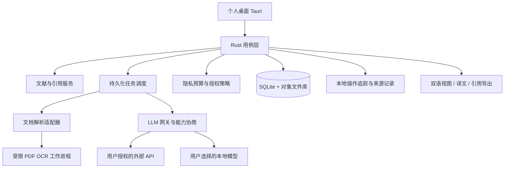

# 架构与编程语言设计

## 架构约束

个人桌面应用，明确不采用 B/S。没有 Axum 服务、PostgreSQL、浏览器客户端、PWA、团队账户或 SaaS。Tauri 使用打包的本机界面及 IPC；不启动本地 HTTP 应用服务器。外部 LLM API 属于用户选择的服务调用，不是本产品 B/S 部署。文献和数据库都在本地，默认不云同步。

## 技术选择

| 层 | 选择 | 理由 / 代价 |
|---|---|---|
| 核心 | Rust，Tokio（未来异步）、Serde、SQLite | 高效内存与并发、领域模型可复用；开发和跨平台依赖打包成本较高 |
| 桌面壳 | Tauri 2 | Rust 后端 + 系统 WebView；需处理不同平台 WebView/权限/安装依赖 |
| 界面 | TypeScript + React + PDF.js | 文献阅读和界面生态成熟；不承担密钥或许可校验；当前未初始化前端 |
| PDF/OCR 工作进程 | BabelDOC/PDFMathTranslate 双引擎；Docling/Tesseract 候选 | 避免重造 OCR；Python 仅作为可替换模型 sidecar，版本、模型和包体单独固定 |
| 元数据与引用 | CSL-JSON + 成熟 CSL 处理器候选 | 可追溯样式和本地生成；处理器与样式各有许可，选型后再锁版本 |

不以“所有代码均用高效语言”为目标。Rust 处理调度、数据与策略，模型计算依赖本地原生库；TypeScript 处理交互，Python sidecar 处理必要的成熟模型生态。效能优先通过缓存、增量处理、页面懒加载和有界并发实现，而不是仅凭语言名称。

Electron 开发生态成熟但运行时通常较重；Flutter 可一体化 UI，但 PDF 阅读、引用生态需更多桥接；全 Rust UI 现阶段提高文本排版和无障碍成本。因此首版采用 Rust/Tauri/TypeScript。

## 逻辑组件

## 领域边界

- `library`：文献 UUID、附件哈希、作者/DOI/原始元数据、标签与人工修改。
- `document`：DocumentIR、页坐标、阅读顺序、段落与图文 OCR 框、不可翻译对象。
- `translation`：翻译版本、术语版本、来源、译文、状态和受保护 token 检查。
- `summary`：结构化结论、证据锚点、人工确认与不足证据状态。
- `citation`：样式版本与哈希、标准元数据及交换格式损失说明。
- `provider`：模型能力、适配器、预算、限流与外发许可；正文是数据，不可成为系统指令。
- `provenance`：构建来源、导出来源和本地事件，不负责判断真实法律商用性质。
- `compliance`（后续）：桌面“关于”页的 AGPL/上游许可、版本、仓库及源码获取说明；无需授权服务器。

新增 `integrations/engines.py` 调用两个独立版本环境的官方 CLI；不依赖不稳定的 BabelDOC 内部 Python API。当前 `crates/polyscholar-core` 仅实现坐标、证据引用、保护 token 和追踪点的领域校验，既不调用模型，也不声称覆盖以上服务。

## 核心数据

`documents`→`files` / `pages`→`blocks`→`translations`；`claims`→`claim_evidence`→`blocks`；`jobs` / `job_chunks` 支持续传；`audit_events` 存最小化事件；`citation_styles` 保留样式哈希。

- 文献 UUID 与文件 SHA-256 分离：相同论文可有预印本/正式版，不能按 DOI 自动合并所有文件。
- 坐标统一为“已应用 CropBox 和页面旋转后的可见页，左上原点，归一化 [0,1]”；保存到 PDF 原始坐标的仿射变换。
- block ID 在某个提取修订内稳定；重新解析建立映射，不重用旧 ID 造成错误摘要定位。
- 缓存键包括文献文件哈希、block 原文哈希、解析修订、源/目标语言、模型标识、提示词哈希、术语版本与输出格式。
- 保存 original metadata 与人工修订；不让 LLM 猜 DOI、作者或年份补全来源。
- 数据库迁移需备份与版本检测；删除文件先检查共享附件引用，删除缓存不删除原件。

可执行的初始模式见 `schemas/001_initial.sql`；完整服务的事务与迁移仍待实现。

## 执行流程与边界

任务状态：queued → running → completed / failed / cancelled；暂停为 paused。分块保存 completed/failed 状态；重启时 running 块转可恢复状态，按成功记录跳过。每次远程请求先取得外发授权并预留预算；重试和切换模型都计预算，同一块用幂等键记录，远端未支持幂等时不能保证零重复费用。

解析工作进程通过版本化 JSON-RPC/NDJSON 与 Rust 通信，使用任务专属目录和允许列表操作；限制页数、文件体积、内存、并发及运行时间。默认无网络，模型下载为独立用户操作。不执行 PDF JavaScript、嵌入附件或论文链接。进程隔离本身不等于沙箱，各平台需额外权限/容器边界验证。

Tauri 最小 capability；CSP 禁止任意脚本/远程代码；动态 URL 经过域名和 HTTPS 校验。密钥保存于 OS 凭据库；Linux 缺 secret service 时明确要求用户选择安全替代，不悄悄降级为明文。API 密钥只传 Rust 后端；禁止在请求 URL、日志、数据库或 GitHub 中出现。

PDF/摘要/图注均是不可信输入；LLM 没有工具执行权限、文件系统权限或授权修改能力。导出 HTML 转义，URI scheme 限制；外部模型端点改动需重新确认数据发送目的地。个人客户端不设计账户、租户、团队服务或 Web 应用入口。

## 跨平台交付策略

- M0：Rust 核心 CI 覆盖 Ubuntu/Windows/macOS；这不是应用验证。
- M1/M2：桌面包目标 Windows 10/11 x64、macOS 13+ arm64/x64、Ubuntu 22.04/24.04 x64，实际最低版本在 PDF/OCR 包和 Tauri 前置依赖确认后冻结。
- 发行矩阵每项实际编译、安装与端到端测试，校验字体、图文对齐、密钥库与工作进程权限；仅发布已验证平台。
- 发布必须生成依赖/模型/字体 SBOM、SHA-256 清单、许可证清单与签名构建来源；签名密钥只在受控发行环境。
- 首版及当前路线只涵盖个人 Windows/macOS/Linux 桌面。移动原生客户端若未来需要，另行提出需求，不在本轮承诺。

参考：[Tauri 架构](https://v2.tauri.app/concept/architecture/)、[PDF.js](https://github.com/mozilla/pdf.js)、[Docling](https://github.com/docling-project/docling)。具体第三方选型未集成，见 THIRD_PARTY_NOTICES.md。
