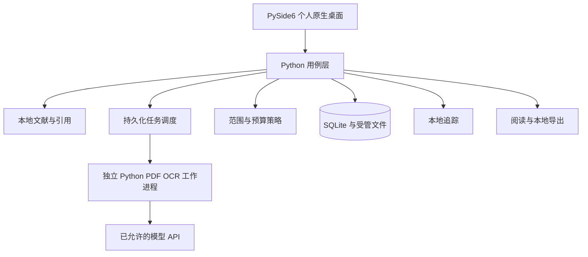

# 架构与编程语言设计

决策更新：2026-10-02。用户明确要求应用全部使用 Python，不使用 Rust 或 Go；此决策替代旧版 Rust/Tauri/TypeScript 方案。应用自有界面、领域服务、数据与任务代码统一为 Python，采用 PySide6 原生桌面控件。第三方 Qt、PDF/模型库可能包含其自身的原生实现，不要求重写这些依赖。

## 架构约束

面向个人 Windows、macOS、Linux 桌面；不采用 B/S，没有 WebView、React、浏览器产品、本地 HTTP 应用服务器、团队账户或 SaaS。PySide6 Widgets 直接调用本机 Python 用例服务，长任务由 Python 工作进程执行；界面线程只负责交互和呈现。文献与 SQLite 数据库留在本地，无云同步。

允许联网业务仅为用户配置的模型 API、DOI 元数据查询、模型/字体下载。文本 API 与模型/字体下载沿用用户明确授权，任务默认允许并携带授权字段，不要求手动双勾选；实际目的地与输入范围仍展示，图片外发等新增范围另行确认。DOI 仅发送标识，资源下载不上传文献。禁止云 OCR、遥测、云文献库与自动公开。详见 [联网范围](09-local-and-network-scope.md)。

## Python 技术选择

| 层 | 选择 | 设计说明 |
|---|---|---|
| 界面 | PySide6 Qt Widgets | 主窗口、集合树、文献表格、详情栏、原生文件对话框；Python 信号/槽绑定，避免另一个前端语言 |
| 用例/领域 | Python 类型标注、dataclass/显式校验 | 元数据、坐标、证据、任务状态、外发范围、来源追踪统一实现，不再维护 Rust 核心 |
| 数据 | Python sqlite3 + 本地受管文件库 | 外键、事务、迁移备份与 WAL；连接归所属线程，长任务不跨线程共享连接 |
| PDF 阅读 | PySide6 QtPdf/QtPdfWidgets | 真实本地页面渲染、缩放与页码；块级定位仍需解析结果映射，不能由页面渲染推导已完成 |
| PDF/OCR 翻译 | BabelDOC/PDFMathTranslate 独立 Python 工作进程 | 官方 CLI 边界、分别锁定依赖，不能把两个冲突环境合并；已有协议适配保留 |
| 模型与元数据 | 本机 Python 服务调用已允许的外部 API | 请求校验、目的地说明、费用未知状态；严格预算与上游载荷隔离仍待实现和验证 |
| 引用 | 本地 Python 可调用的成熟 CSL 处理器候选 | 样式与处理器独立许可审查、金标测试，未接入前禁用格式化引用 |
| 发行 | PyInstaller 优先验证，pyside6-deploy 候选 | 发行自带 Python 与 Qt 运行组件，不要求个人用户先装 Python；分别构建和测试各目标平台 |

性能通过文件流式哈希、SQLite 索引、页面懒加载、缓存、增量任务和有界工作进程实现。CPU 密集解析不占用 GUI 线程；模型运算可使用第三方原生库。语言统一不代表全部 PDF 可以无损翻译，需实测。

Qt 官方提供 [QPdfView](https://doc.qt.io/qtforpython-6/PySide6/QtPdfWidgets/QPdfView.html) 的 Python 页面视图接口；能力接入与块级解析是不同交付。应用代码不编写 C++/Rust/Go。pyside6-deploy 是封装 Nuitka 的部署工具，工具内部可将 Python 编译并链接 libpython；这是发行实现，不增加应用开发语言。[官方部署说明](https://doc.qt.io/qtforpython-6/deployment/deployment-pyside6-deploy.html)

## 逻辑组件

## 领域与数据

以下为目标领域模型。当前运行时 SQLite v3 与未来 DocumentIR 参考设计的差异见 [数据模型状态](../schemas/README.md)；块级证据与摘要尚未实现。

library 负责集合/子集合、多集合成员、类型化条目/作者、标签、附件、笔记、检索和恢复；逐步对标 [Zotero 矩阵](12-zotero-parity.md)。基础 PDF 列表不是完整文献管理。

document 负责 DocumentIR、阅读顺序、段落/图文 OCR 框和不可翻译对象；translation 保存译文版本、术语、模型与保护 token 校验；summary 保存结论与证据；citation 保存标准元数据、样式版本/哈希与交换格式损失；provider 负责请求范围/授权字段和错误；provenance 保存最小本地事件；compliance 提供关于/许可证/源码入口，不建立授权服务器。

文献 UUID 与文件 SHA-256 分离，同 DOI 的预印本和正式版不自动合并。坐标使用已应用 CropBox/旋转的可见页、左上原点与归一化 [0,1]，保留仿射变换；重新解析建立 block 映射，不重用旧 ID。缓存键包含文件/原文哈希、解析修订、模型、语言、提示词和术语版本。

集合是组织关系而不是文件目录；事务保证多集合不复制附件，集合移除不等于删除条目。原始元数据与人工修订分别保留，LLM 不猜 DOI/作者/年份补全。数据库迁移必须版本检测与备份；共享附件按引用计数处理，缓存清理不删除原件。

已有 integrations/engines.py 与 integrations/job_worker.py 是 Python 引擎边界，可迁移复用；自有领域和桌面服务改为 Python 后以实际测试重新验收。旧架构验证不等于新原生桌面已完成。

## 执行与隐私边界

状态 queued → running → completed/failed/cancelled，paused 与恢复只在真实支持后启用。费用/百分比不可观测时为未知；成功必须进程退出且产物有效，不以 UI 点击成功判断。已完成块续传与严格预算属于目标能力，不能伪称现有。

桌面服务与工作进程通过版本化 JSON/NDJSON 和 stdin/stdout 通信，不使用 shell；密钥只随任务 stdin 传递，不放 argv/环境/数据库/日志。工作进程验证字段与固定版本，限制输入/时间/并发、任务专属输出目录，失败清理临时凭据与部分产物；取消终止进程树并说明远端请求可能仍计费。进程隔离不等于沙箱，上游联网载荷仍需逐平台检查。

密钥优先 OS 凭据库；尚未接入时只支持本次会话内存，不降级明文保存。Python UI 输入清空后服务不回传密钥，普通设置只保存非秘密配置。endpoint 保存前拒绝凭据、query、fragment 和非 HTTPS（明确本机 loopback HTTP 除外）。

不执行 PDF JavaScript、嵌入附件或正文中的操作指令；模型没有工具/文件权限。输出文本按原生纯文本显示，外部链接限制 URI scheme；导出后端复核实际路径和哈希。正文、日志、缓存与 SQLite 都不推送 GitHub。

缓存目录可选且验证可写，解释器自动发现/固定版本探测、自定义只在高级设置；译文 PDF 原生保存导出拒绝覆盖原件。发行内置两个锁定引擎运行组件的具体组织须验证依赖冲突、包体与更新，不能拿 GUI 冻结成功证明引擎已随包可用。

## 跨平台发行与验证

- 基线采用 Python 单元/集成与 PySide6 本机 GUI 检查；核心测试通过不表示安装包可运行。
- PyInstaller 可收集 Python 解释器及依赖；官方说明不支持由一个操作系统交叉生成所有平台包，须按平台构建。[PyInstaller 运行原理](https://pyinstaller.org/en/stable/operating-mode.html)
- pyside6-deploy 官方描述 Windows exe、Linux bin 和 macOS app 产物；实际签名、安装、Qt PDF 插件、引擎环境及运行路径仍分别验证，工具支持不等于项目已通过。
- 最低 Windows/macOS/Linux 版本由选定 PySide6/Python/模型依赖冻结后确定；原来的目标只是规划，不承诺全部已支持。
- 发行自带运行时，在未安装 Python 的干净机器检验首次启动、资源准备、导入、阅读、翻译任务、导出和安全删除；Linux 凭据服务、Windows ACL/macOS 签名另测。
- 仅发布实际验收的平台，生成 SBOM、依赖/字体/模型许可、哈希清单、相应源码包与构建说明；无完整签名/打包结果时如实记为未验证。

原有六屏 UI、AGPL 许可、默认允许两类任务联网、个人本地范围与 Zotero 对标目标继续有效。Qt/PySide6 及打包依赖按实际使用模块审查许可，不因改为 Python 自动解决全部第三方合规。
